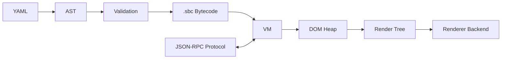

# SUGI Architecture

SUGI treats YAML as a source language only. Runtime clients communicate through transport-independent protocol messages. The VM owns stable node handles, serializable state, event dispatch, subscriptions, bytecode execution, and package mount bookkeeping; renderers consume render trees and never parse YAML.

## Phase 1 vertical slice

- YAML page trees compile into binary `SUGI` version 1 bytecode.
- Bytecode instructions include node creation, property and variable mutation, child links, events, mounts, calls, and no-op support.
- The VM executes bytecode into a DOM heap with stable integer handles.
- Query selectors support IDs, classes, type names, descendant selectors, direct-child selectors, and simple data/property equality selectors.
- Events report capture, target, and bubble delivery paths.
- The protocol dispatcher accepts JSON-RPC style command dictionaries without depending on a transport.
- Render tree generation is backend independent.
